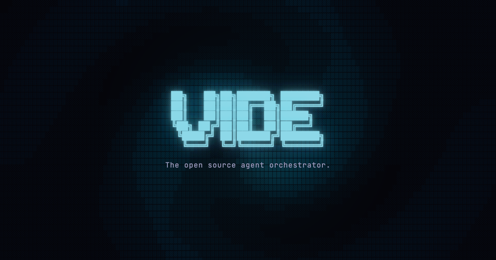

[](https://github.com/Norbert515/vide_cli/actions/workflows/test.yml)
[](LICENSE)
[](https://github.com/Norbert515/vide_cli)
[](https://vide.dev)

<p align="center">

</p>

<p align="center">
<a href="https://vide.dev"><strong>Website</strong></a> |
<a href="https://github.com/Norbert515/vide_cli"><strong>GitHub</strong></a>
</p>

**The open source agent orchestrator.** Instead of one AI conversation, Vide orchestrates a team of specialized agents that research, implement, review, and test your code -- all working in parallel.

## Install

```bash
# macOS / Linux
curl -fsSL https://raw.githubusercontent.com/Norbert515/vide_cli/main/scripts/install.sh | bash

# Windows
irm https://raw.githubusercontent.com/Norbert515/vide_cli/main/scripts/install.ps1 | iex
```

Requires [Claude Code CLI](https://docs.anthropic.com/en/docs/claude-code) (`npm install -g @anthropic-ai/claude-code`).

Then just run:

```bash
vide
```

## Agent Teams, Not Single Agents

Most AI coding tools give you one agent in one conversation. Vide gives you a team.

A lead agent breaks down your request and spawns specialists -- researcher, implementer, tester -- that work in parallel across separate git worktrees. They communicate asynchronously and iterate through review rounds until the job is done.

<p align="center">

</p>

## Collaboration Built In

Agents don't just run in parallel -- they collaborate. The orchestrator delegates to an implementer, a QA agent reviews the result, issues get fixed, another round of review. This loop repeats until quality is met.

Structured engineering workflows, not just autocomplete.

## Remote Control

Run your agent teams on a remote server and connect from anywhere. Vide includes a daemon that manages sessions as sub-processes, with a REST API and WebSocket streaming for real-time control.

### Quick Start (Local Daemon)

```bash
# Start the daemon
vide daemon start
```

Then open Vide and press `Tab` to open settings -- enable daemon mode there. The TUI works identically in daemon mode -- the same UI, same workflows, just backed by daemon-managed sessions that persist even if the TUI disconnects.

### Remote Access

Run the daemon on a VPS and connect from your laptop:

```bash
# On the VPS
vide daemon start --host $(tailscale ip -4) --port 8080

# From your laptop
vide connect 100.64.12.34:8080
```

[Tailscale](https://tailscale.com) is the recommended way to handle remote access. It creates encrypted peer-to-peer tunnels between your devices using WireGuard -- no port forwarding, no public exposure, no extra auth layer needed.

<details>
<summary>Setting up Tailscale on a VPS</summary>

**1. Install on both your VPS and laptop:**

```bash
# VPS (Ubuntu/Debian)
curl -fsSL https://tailscale.com/install.sh | sh
sudo tailscale up
sudo systemctl enable --now tailscaled

# macOS laptop
brew install tailscale
```

**2. Start the daemon bound to the Tailscale IP:**

```bash
TS_IP=$(tailscale ip -4)
vide daemon start --host $TS_IP --port 8080
```

The Tailscale IP (`100.x.x.x`) is in the CGNAT range -- never routed on the public internet. Your daemon is only reachable by devices on your tailnet.

**3. Connect from your laptop:**

```bash
vide connect 100.64.12.34:8080

# Or with MagicDNS:
vide connect my-vps.my-tailnet.ts.net:8080
```

**4. (Optional) Install as a system service:**

```bash
# Auto-start the daemon on boot
vide daemon install
```

</details>

### Daemon CLI

```bash
vide daemon start              # Start the daemon (foreground)
vide daemon start --detach     # Start in background
vide daemon stop               # Stop the daemon
vide daemon status             # Check if running
vide daemon install            # Install as system service (launchd/systemd)
vide daemon uninstall          # Remove system service
```

### Architecture

```
Laptop (TUI)                        VPS
    │                                │
    │── vide connect ──────────────► │  vide daemon (port 8080)
    │                                │    ├── session A (vide_server :54321)
    │◄─── WebSocket stream ─────────│    ├── session B (vide_server :54322)
    │                                │    └── session C (vide_server :54323)
```

The daemon spawns a separate `vide_server` process per session for full isolation. Sessions persist across daemon restarts and survive client disconnects. Multiple TUI clients can connect to the same session simultaneously.

## Multi-Backend

Vide doesn't call models directly -- it orchestrates full agent frameworks via their SDKs. Currently built on Claude Code. Codex CLI and Gemini CLI are on the roadmap. Same agent teams, same workflows, always using the best each framework has to offer.

## Features

- **Flutter-first** -- hot reload, vision AI (Moondream), widget inspection, screenshot capture
- **Git worktrees** -- each feature team works on its own branch in isolation
- **Custom agents** -- drop `.md` files into `.claude/agents/` to define your own specialists
- **60fps terminal UI** -- a real TUI built on nocterm, not scrolling text
- **Open source** -- Apache 2.0. Extend with MCP servers. Build on top of it.

## License

[Apache License 2.0](LICENSE)
